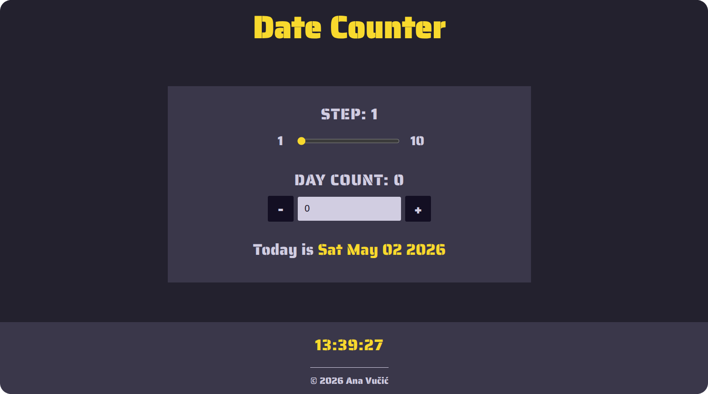
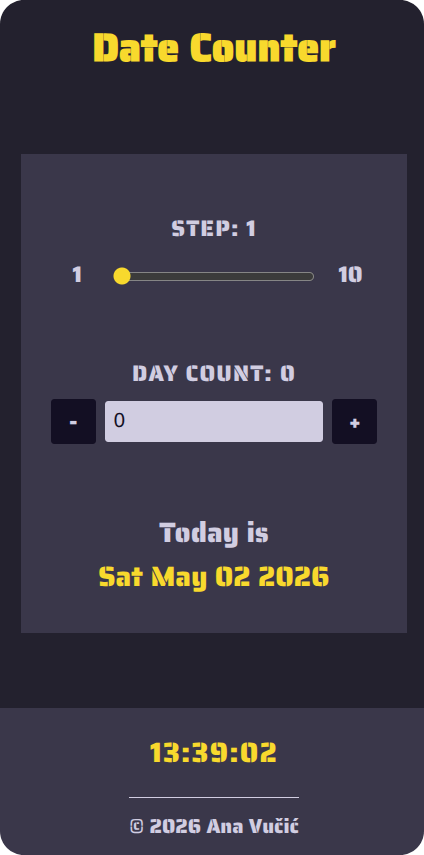

# 📆 Date Counter

A React exercise focused on controlled inputs, predictable state updates, and accessible UI behavior.

     

---

## 🎯 Goal

Practice managing user input and state transitions in a controlled and predictable way.

---

## 📸 Screenshots

  
<strong>View Screenshots</strong>

   

### Date Counter (Mobile)

---

## ✨ Features

- Adjustable step using a range input
- Increment/decrement controls for day counting
- Text input with validation for numeric values
- Dynamic date calculation based on user input
- Reset functionality

---

## 🔧 Improvements & Enhancements

Compared to the initial exercise, this version includes:

- Reusable components for better structure
- Semantic HTML (`header`, `main`, `footer`, `fieldset`, `legend`)
- Accessible form patterns and ARIA attributes
- Live region for screen-reader announcements
- Input validation to prevent invalid numeric states
- Helper function (`getMessage`) extracted into a `utils` directory
- Custom focus styles for improved keyboard navigation
- Responsive, mobile-first styling
- A real-time clock in the footer for additional dynamic UI behavior

---

## 🧠 Key Learnings

- Handling controlled inputs with validation logic
- Preventing invalid intermediate states (e.g., empty string, `-`)
- Keeping UI and state in sync consistently
- Using derived values (date calculation based on state)
- Structuring components with clear responsibilities

---

## 🤝 Accessibility

- Semantic HTML for improved structure and navigation
- Proper form labeling and assistive descriptions
- Live region (`aria-live="polite"`) for dynamic updates
- Screen-reader-friendly hidden text and labels
- Keyboard-friendly interaction with visible focus states
- Respect for user motion preferences (`prefers-reduced-motion`)

---

## 🎨 UI & UX

- Responsive, mobile-first layout
- Clear visual grouping of controls
- Real-time feedback on user input
- Integrated live clock in the footer

---

## 🛠️ Tech Stack

- React
- JavaScript (ES6+)
- CSS (responsive, mobile-first)

---

## 📒 Notes

This is one of my early React exercises, focused on building a strong foundation in state management and input handling.

---
