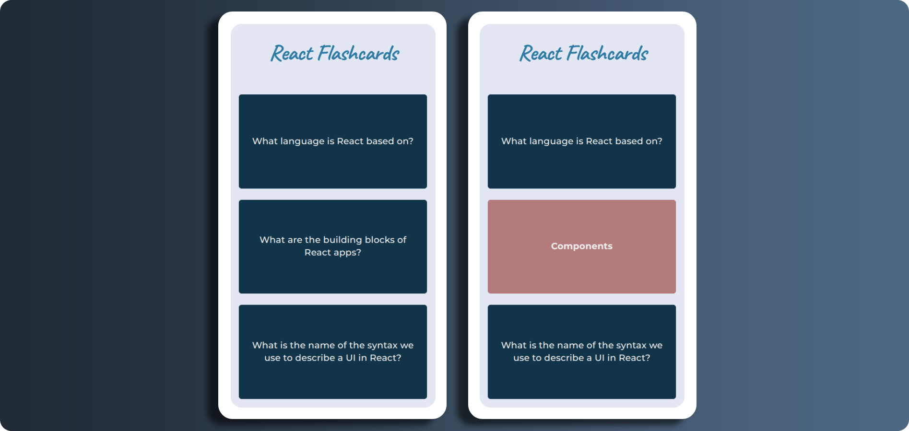
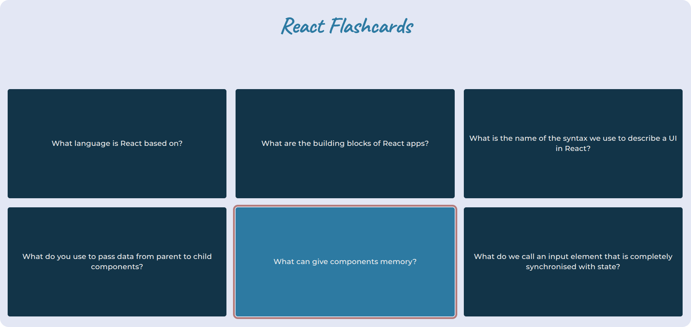
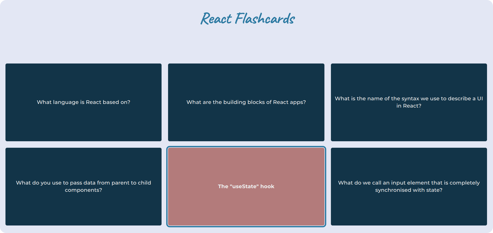
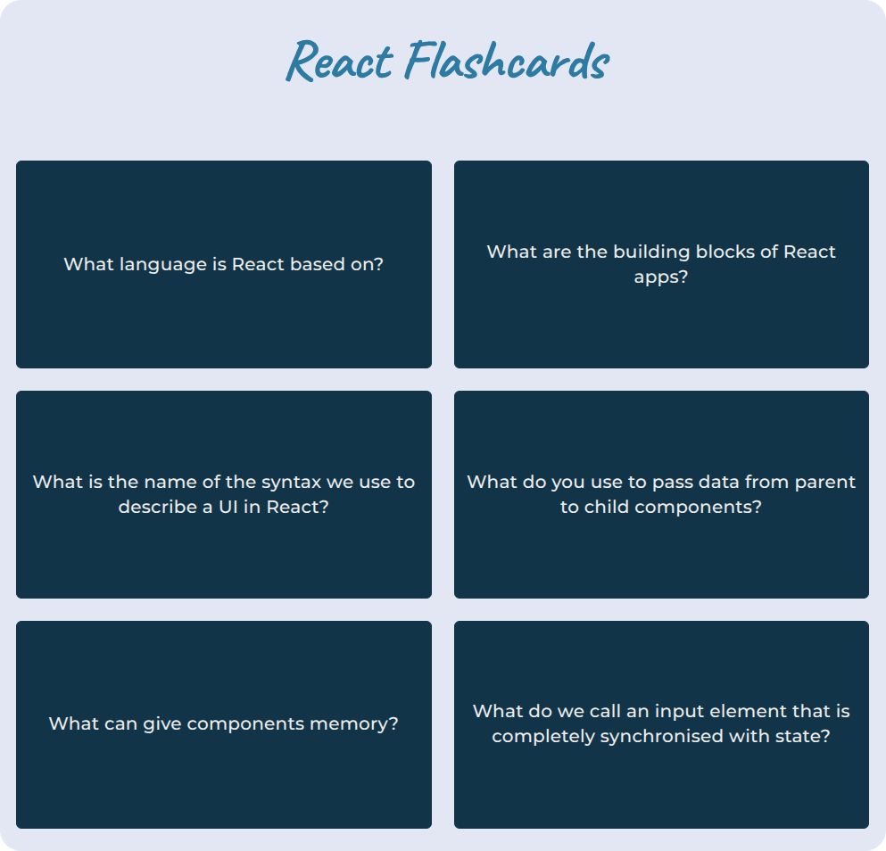

# 📑 Flashcards

A React exercise focused on state-driven rendering and interactive UI patterns.

     

---

## 🎯 Goal

Practice conditional rendering and managing UI state for user interactions.

---

## 📸 Screenshots

  
<strong>View Screenshots</strong>

   

### Focused Question (Desktop)

### Focused Answer (Desktop)

### Flashcards on Tablet

---

## ✨ Features

- Clickable flashcards that toggle between question and answer
- Single-selection behavior, ensuring clear focus on one item at a time
- Data-driven rendering from a structured array
- Scalable structure for rendering larger datasets

---

## 🔧 Improvements & Enhancements

Compared to the initial exercise, this version includes:

- Semantic structure (`header`, `main`, `footer`)
- Reusable components
- Accessible ARIA attributes
- Custom focus styles for better keyboard navigation
- The `questions` array extracted into a `data` directory
- Responsive layout

---

## 🧠 Key Learnings

- Rendering lists from data using `map`
- Managing selected state for interactive components
- Toggling UI based on user input
- Keeping components simple and focused

---

## 🤝 Accessibility

- Semantic markup for better structure and navigation
- Buttons for interactive elements (keyboard-accessible by default)
- Toggle state communicated via `aria-pressed`
- Visible focus styles for keyboard navigation
- `prefers-reduced-motion` support for users sensitive to animation

---

## 🎨 UI & UX

- Responsive grid layout (mobile-first)
- Clear visual feedback for selected cards
- Focus-visible styling for better keyboard usability
- Minimal, distraction-free interface for focused interaction

---

## 🛠️ Tech Stack

- React
- JavaScript (ES6+)
- CSS (responsive, mobile-first)

---

## 📒 Notes

An early React exercise focused on building interactive components using simple state logic.

---
