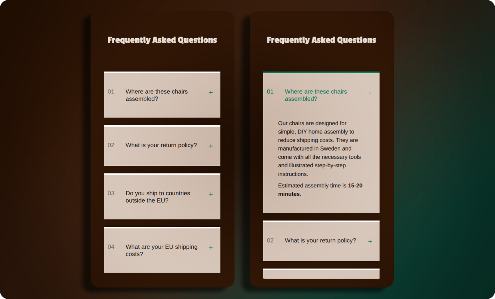
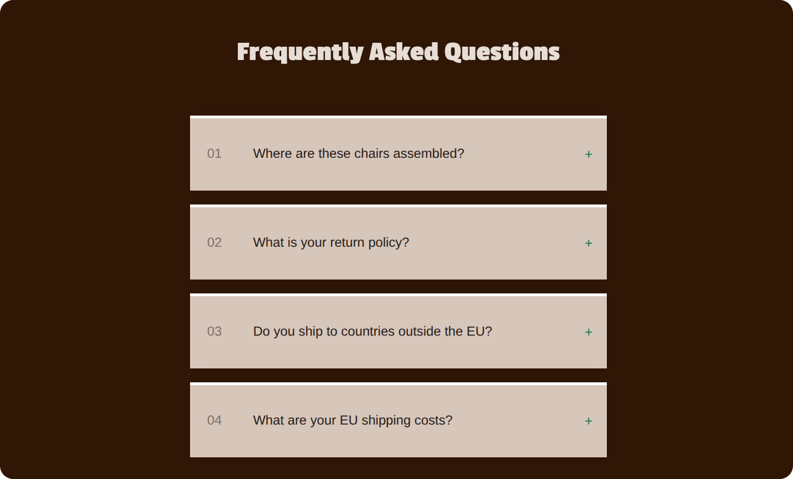
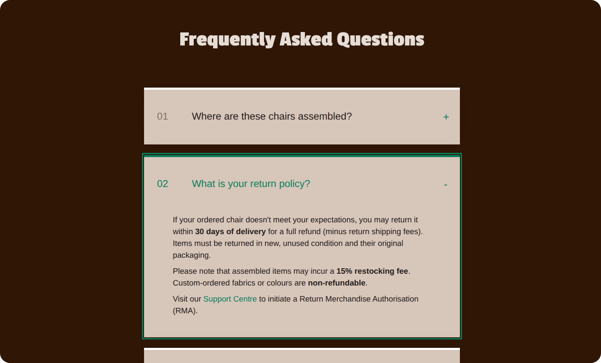
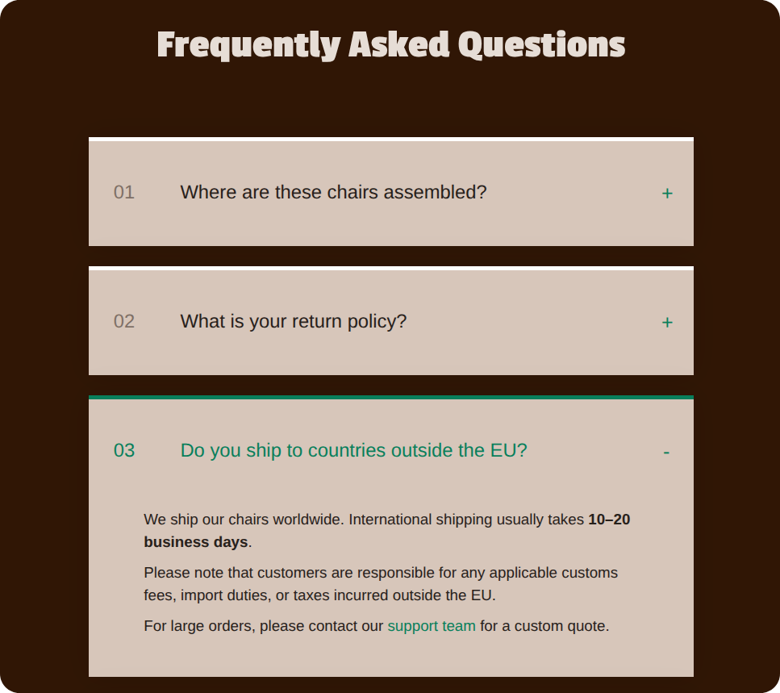

# 🪗 FAQ Accordion

A reusable React accordion component focused on accessible interactions and scalable component structure.

     

---

## 🎯 Goal

Practice building reusable UI components with clear state management and accessible behavior.

---

## 📸 Screenshots

  
<strong>View Screenshots</strong>

   

### Default State (Desktop)

### Expanded/Focused State (Desktop)

### Expanded State (Tablet)

---

## ✨ Features

- Expandable/collapsible accordion items with single-item open behavior
- Data-driven rendering from a structured array
- Support for rich JSX content (paragraphs, lists, links)
- Stable state management using unique IDs

---

## 🔧 Improvements & Enhancements

Compared to the initial exercise, this version includes:

- Reusable `Header` and `Footer` components
- Semantic markup (`header`, `main`, `section`, `footer`)
- Button-based accordion interactions with proper heading structure
- ARIA attributes for accessible accordion behavior
- ID-based state management for accordion items
- Rich JSX content support in the data array
- Real-world content instead of placeholder text
- Responsive design

---

## 🧠 Key Learnings

- Managing UI state using stable, ID-based logic
- Designing reusable components with flexible data input
- Structuring components into smaller, focused units
- Supporting rich content through JSX composition
- Separating presentation from data through component props

---

## 🤝 Accessibility

- Semantic structure
- `aria-expanded`, `aria-controls`, and `aria-labelledby` for proper relationships
- Keyboard-accessible interactions via buttons
- Focus-visible styling for improved navigation

---

## 🎨 UI & UX

- Clean, readable layout with clear hierarchy
- Visual indicators for open/closed state
- Responsive design with consistent spacing and typography
- Realistic content for a more production-like feel

---

## 🛠️ Tech Stack

- React
- JavaScript (ES6+)
- CSS (responsive, mobile-first)

---

## 📒 Notes

An early exercise focused on building reusable and accessible UI components using simple state logic.

---
