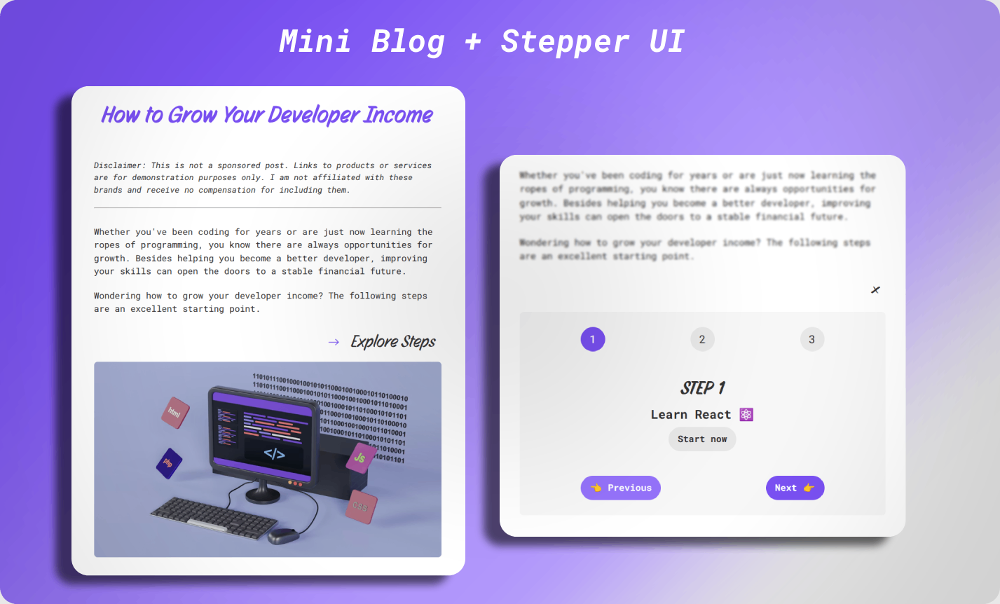
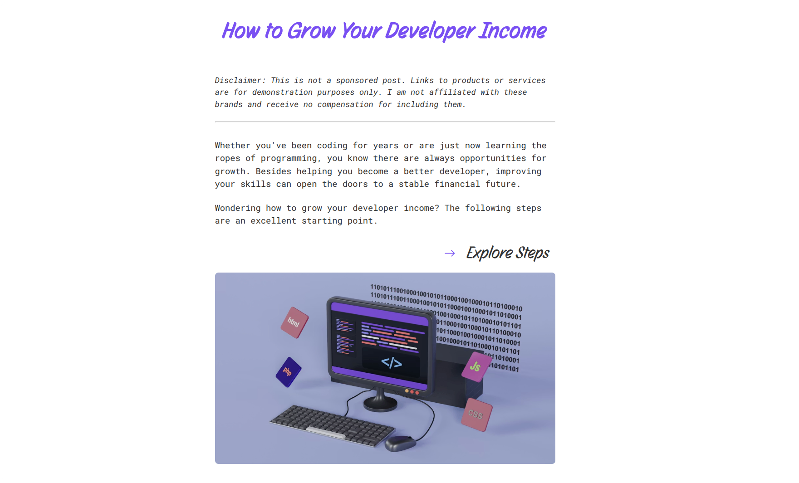
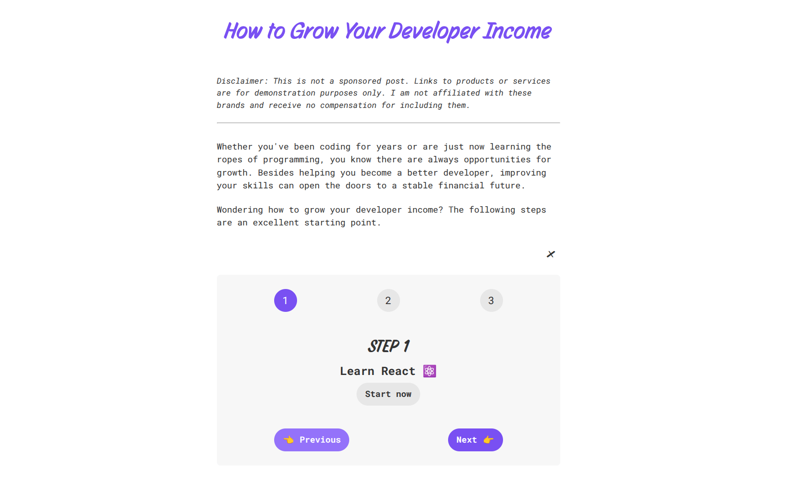
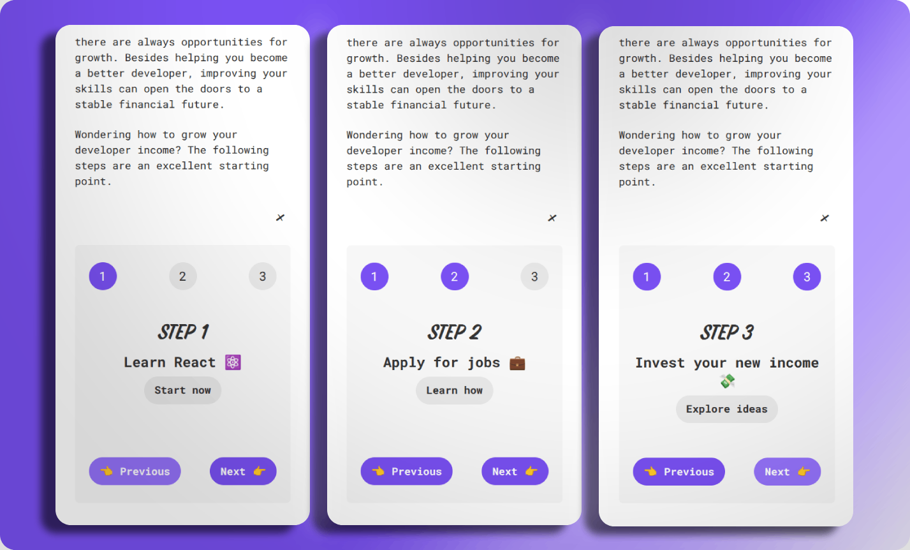

# 🪜 Stepper

A React exercise focused on building a multi-step interface with progressive disclosure and real-world content structure.

     

---

## 🎯 Goal

Practice building interactive multi-step UI patterns with clear state transitions and accessible behavior.

---

## 📸 Screenshots

  
<strong>View Screenshots</strong>

  
   

### Closed State (Desktop)

### Open State (Desktop)

### All Steps (Mobile)

---

## ✨ Features

- Expandable stepper interface with progressive disclosure
- Multi-step navigation with next/previous controls
- Data-driven rendering of step content
- External links integrated into each step
- Visual step indicators with active state feedback

---

## 🔧 Improvements & Enhancements

Compared to the initial exercise, this version includes:

- Semantic structure (`header`, `article`, `section`, `footer`)
- ARIA attributes (`aria-expanded`, `aria-controls`, `aria-label`)
- Reusable `Link` component
- Content structured as a mini blog post with introduction and steps
- Image fallback when the stepper is closed to avoid empty layout
- Responsive, mobile-first design
- Reduced motion support (`prefers-reduced-motion`)

---

## 🧠 Key Learnings

- Managing multi-step UI with controlled state (`step`, `isOpen`)
- Designing components that combine content and interaction
- Structuring UI for progressive disclosure
- Composing reusable UI elements (buttons, links)
- Enhancing basic exercises with real-world context

---

## 🤝 Accessibility

- Semantic HTML structure for meaningful content hierarchy
- Button-based interactions for keyboard accessibility
- `aria-expanded` and `aria-controls` for toggle behavior
- Clear labeling for interactive elements
- Focus-visible styles for improved navigation
- Respect for user motion preferences

---

## 🎨 UI & UX

- Clean, readable layout with a blog-like structure
- Progressive reveal of content to reduce cognitive load
- Visual feedback for the current step
- Integrated imagery to maintain visual balance when collapsed

---

## 🛠️ Tech Stack

- React
- JavaScript (ES6+)
- CSS (responsive, mobile-first)

---

## 📒 Notes

This project expands on a basic stepper exercise by introducing real-world structure and content, turning it into a guided mini experience rather than a purely technical demo.

---
