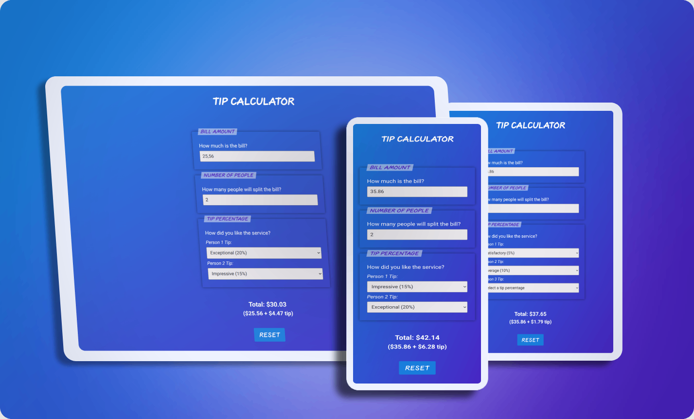
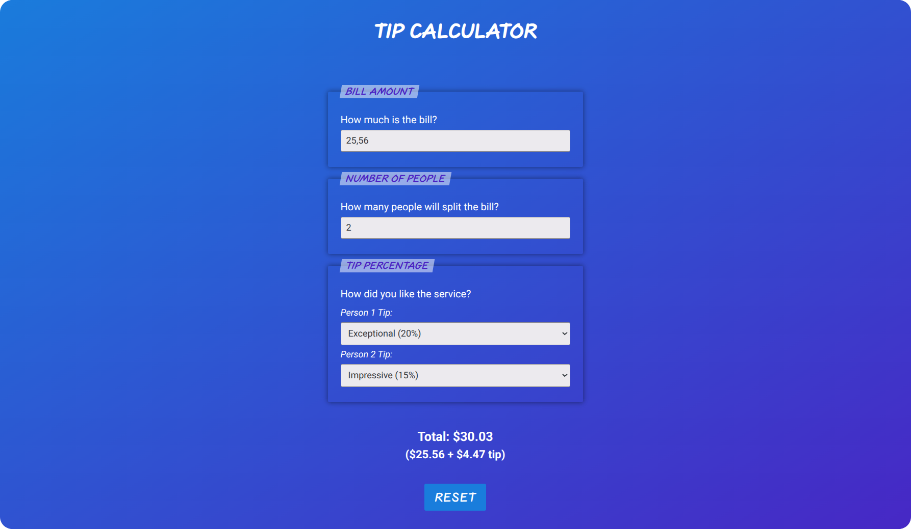
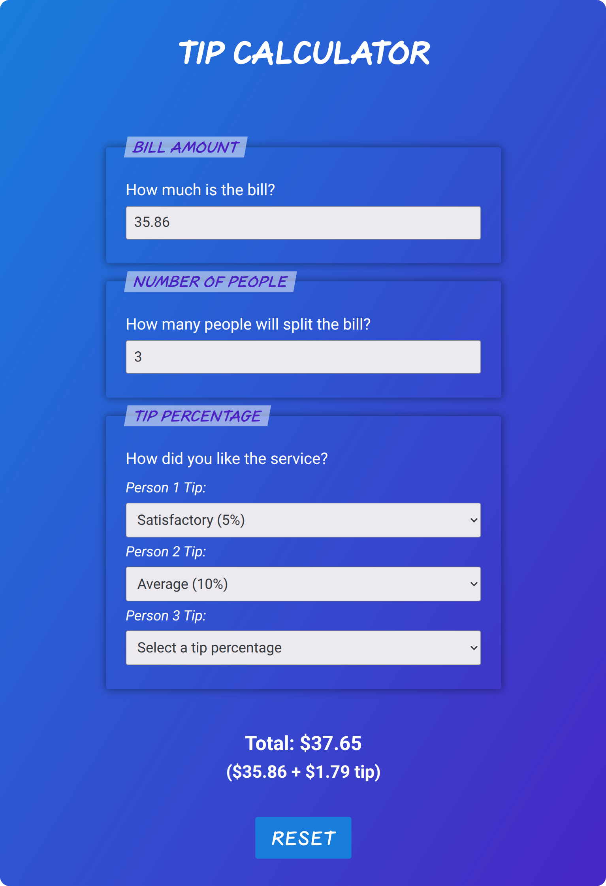

# 💰 Tip Calculator

A React exercise focused on derived state, controlled inputs, and dynamic component rendering.

     

---

## 🎯 Goal

Practice handling multiple inputs and calculating derived values based on user interaction.

---

## 📸 Screenshots

  
<strong>View Screenshots</strong>

   

### Desktop View

### Tablet View

### Mobile View

---

## ✨ Features

- Bill input with validation and locale-friendly parsing
- Dynamic number of people (with a configurable limit)
- Individual tip selection per person
- Automatic calculation of total tip using the average tip percentage
- Reset functionality

---

## 🔧 Improvements & Enhancements

Compared to the initial exercise, this version includes:

- Semantic HTML elements (`header`, `form`, `section`, `footer`)
- Input validation and locale awareness
- Configuration for a dynamic number of people
- Currency formatting
- `useMemo` hook for memoizing the currency formatter
- Reusable components
- Screen-reader announcements for total updates
- Responsive design

---

## 🧠 Key Learnings

- Handling multiple controlled inputs with validation
- Managing dynamic collections of data (per-person tips)
- Calculating derived state from multiple sources
- Structuring components for clarity and scalability

---

## 🤝 Accessibility

- Semantic form structure (`fieldset`, `legend`, `label`)
- Clear input labeling and grouping
- Live region (`aria-live="polite"`) for announcing total updates
- Keyboard-friendly form controls with custom focus styling
- Respect for reduced-motion user preferences

---

## 🎨 UI & UX

- Responsive, mobile-first layout
- Clear grouping of inputs and calculated results
- Real-time calculation feedback
- Consistent focus styles for better usability

---

## 🛠️ Tech Stack

- React
- JavaScript (ES6+)
- CSS (responsive, mobile-first)

---

## 📒 Notes

An early exercise focused on combining controlled inputs, dynamic rendering, and derived state into a cohesive user interface.

---
