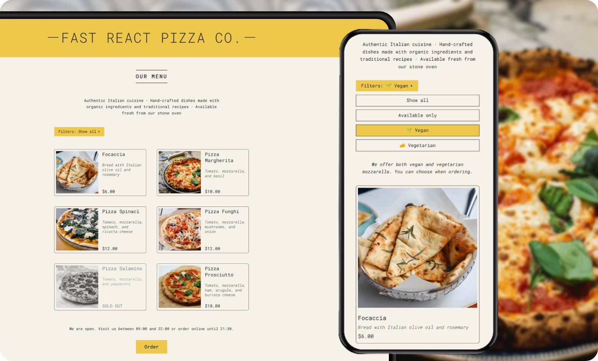
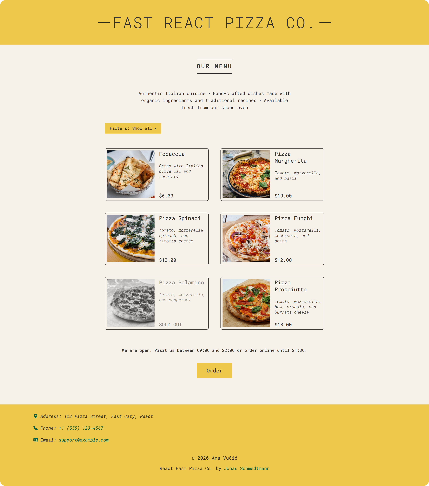
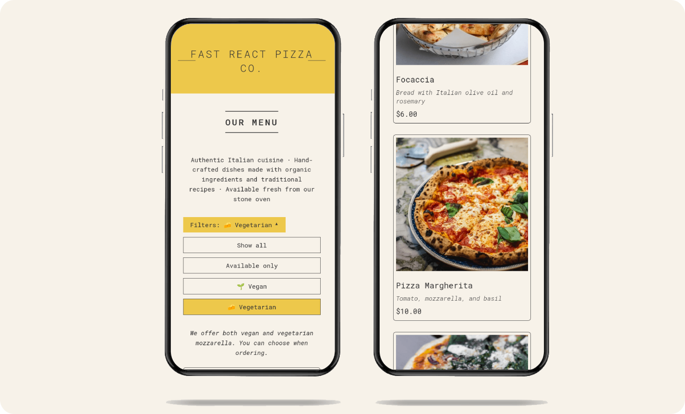

# 🍕 Pizza Menu

A React exercise focused on component composition, data-based filtering, conditional rendering, and accessible interactive UI.

     

---

## 🎯 Goal

Practice building a data-driven React interface with reusable components, interactive filtering, and conditional UI states.

---

## 📸 Screenshots

  
<strong>View Screenshots</strong>

   

### Desktop View

### Mobile View

---

## ✨ Features

- Pizza menu with ingredient and pricing information
- Filtering by availability, vegan, and vegetarian options
- Reusable `Pizza` and `Order` components
- Conditional rendering for empty menus, sold-out pizzas, and business hours
- Responsive layout across all screen sizes

---

## 🔧 Improvements & Enhancements

Compared to the initial exercise, this version includes:

- Data-driven filter configuration with reusable filter functions
- Separate filter state and derived filtered menu data
- Reusable `MenuFilters` and `Footer` components
- Responsive filter drawer with keyboard support and smooth CSS transitions
- Currency formatting with `Intl.NumberFormat`
- Cloudinary-hosted pizza images with explicit dimensions and lazy loading
- Semantic HTML structure and accessible interactive controls
- Responsive design
- CSS organized into component-specific stylesheets

---

## 🧠 Key Learnings

- Rendering dynamic lists from structured data
- Managing and deriving state with React hooks
- Creating reusable, data-driven UI components
- Filtering collections based on multiple criteria
- Using conditional rendering for different application states
- Formatting values with the `Intl` API
- Building interactive UI with keyboard accessibility in mind

---

## 🤝 Accessibility

- Semantic HTML elements for page structure and content grouping
- Accessible labels and headings for major sections
- `fieldset` and `legend` for grouping filter controls
- `aria-expanded` and `aria-controls` for the filter drawer
- `aria-pressed` for the active filter
- Keyboard support for closing the filter drawer with `Escape`
- Focus returned to the filter toggle after closing the drawer
- Descriptive image alternative text
- Semantic `<time>` elements for business hours
- Decorative icons and emoji hidden from screen readers where appropriate
- Visible focus styles for interactive controls
- Reduced-motion support

---

## 🎨 UI & UX

- Mobile-first design
- Adaptive layout for tablet, desktop, and 4K screens
- Compact filter drawer on smaller screens
- Immediate feedback when changing filters
- Clear visual distinction for sold-out menu items
- Dynamic open/closed messaging based on current time
- Consistent interactive states and focus styling

---

## 🛠️ Tech Stack

- React
- JavaScript (ES6+)
- CSS (modular, mobile-first)

---

## 📒 Notes

An early exercise in turning a static restaurant menu into a reusable React interface with dynamic filtering, conditional rendering, and accessible interactive controls.

---
